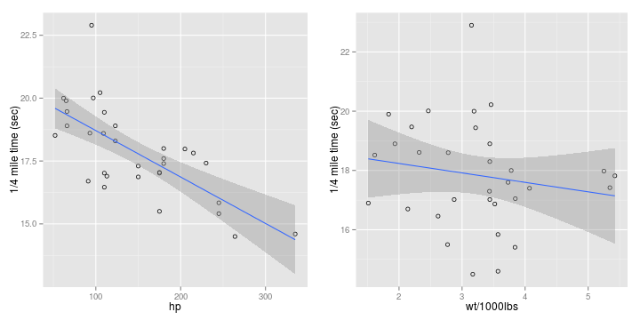

## Predict Your Vehicle's 1/4 Mile Time

* Don't have access to a test track?
* Dealer won't let you 'see what this car can really do' on your test drive?
* Predict your vehicle's 1/4 mile time with this new app!

--- .class #id 

## The Data

* This app uses the [mtcars](https://stat.ethz.ch/R-manual/R-devel/library/datasets/html/mtcars.html) data set in R to fit a linear model to predict 1/4 mile time given vehicle horsepower and weight.

* The relationship between hp and weight and 1/4 mile speed can be seen:


 

---

## The Predictor Algorithm

* First we fit a linear model:

```r
fit1 <- lm(qsec~hp + wt, data = mtcars)
```

* We can predict the 1/4 mile time for a vehicle of 2000lbs and 200hp:

```r
predict(fit1, data.frame(hp = 200, wt = 2),
        interval = "prediction")
```

```
##        fit      lwr     upr
## 1 15.24673 12.77815 17.7153
```

* Notice the prediction interval is several seconds. But if you want more precision, you will have to pay for the upgraded app!

---

## Building the App

* The shiny app is built with two files:
* ui.R 
    + Creates a sidebar that allows user input, via a slider, for hp and wt. 
    + Creates a main panel that has 2 tabs: Results and About. 
    + The About tab describes the function the app performs. 
* server.R
    + Does the math.
* These files can be found at my github repo here:
    + https://github.com/mykelagrene/Rdataproducts


---

## Use the App!

* Here is the url:
    + https://mykelagrene.shinyapps.io/project
  
* Enjoy!


